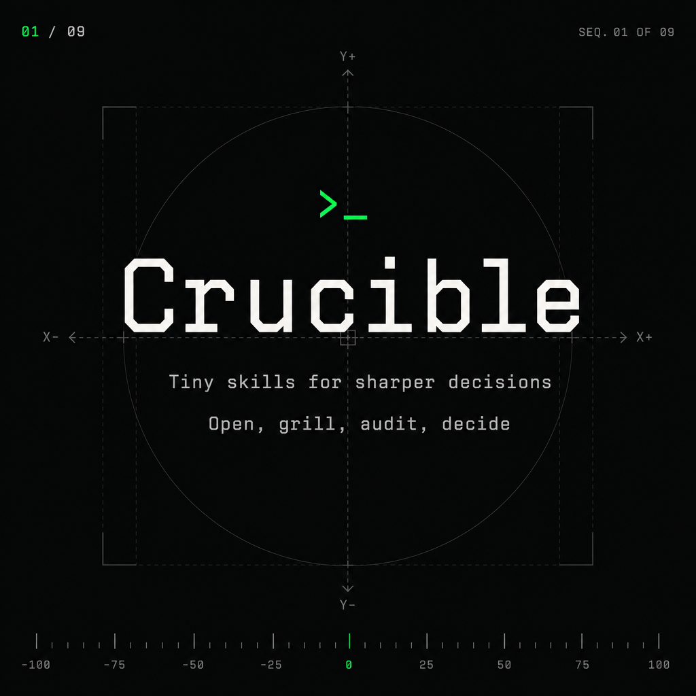
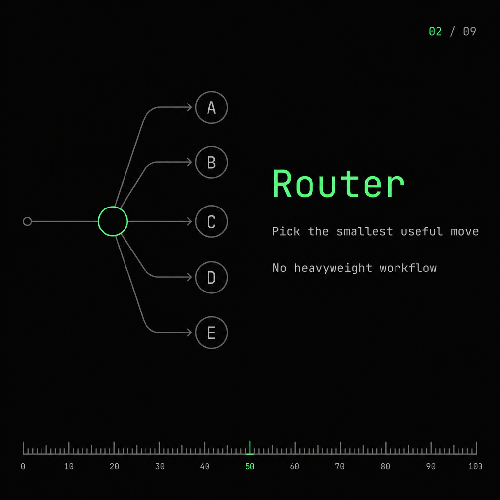
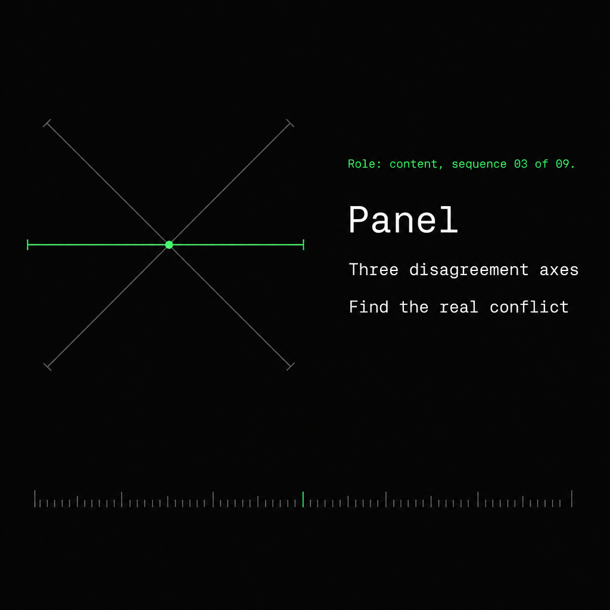
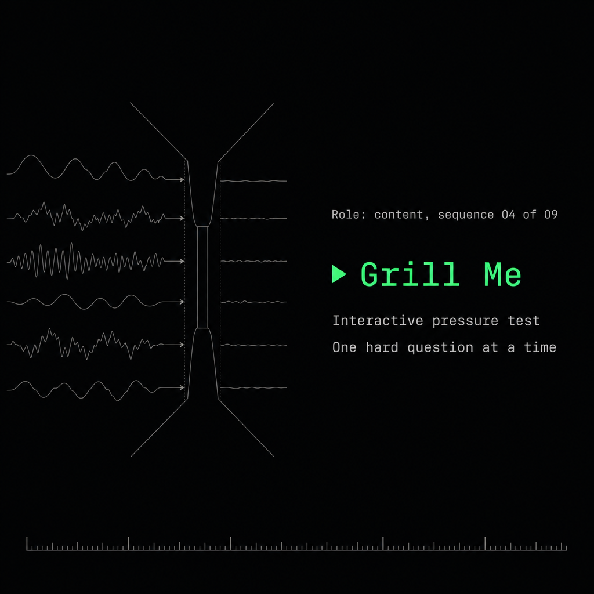
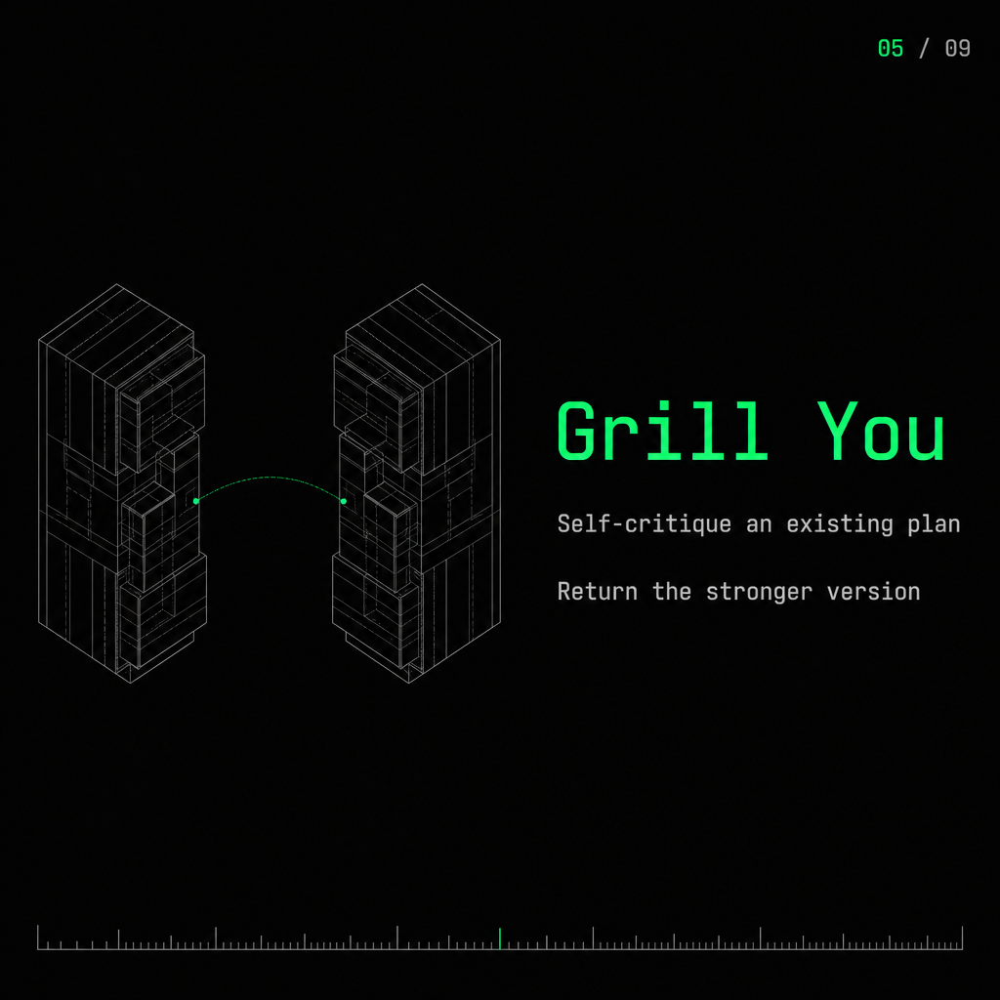
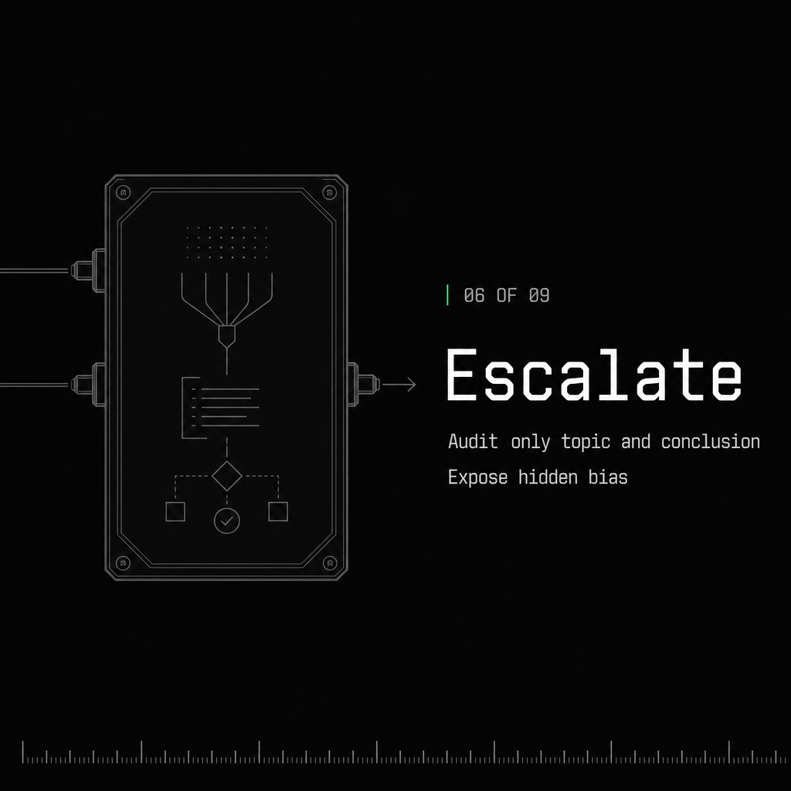
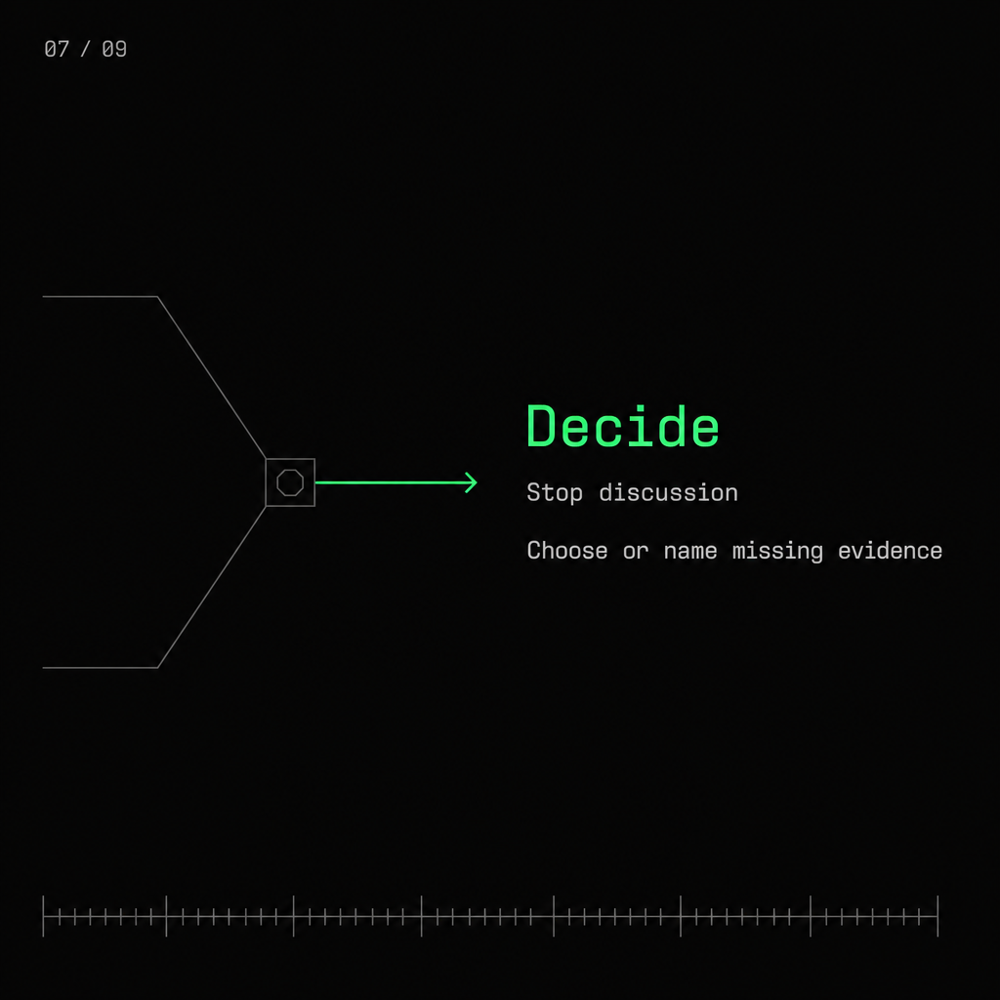
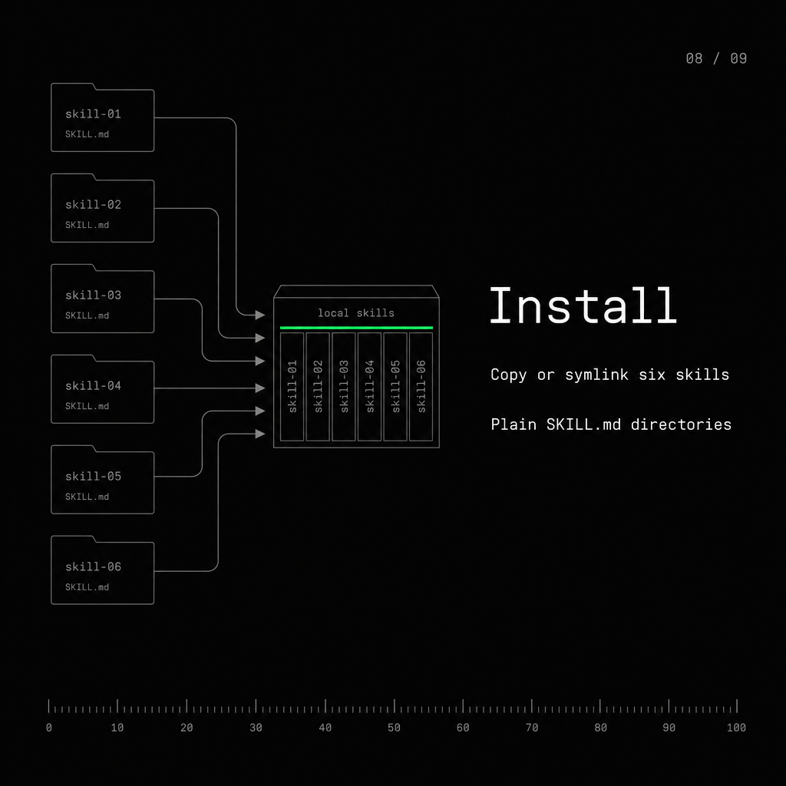
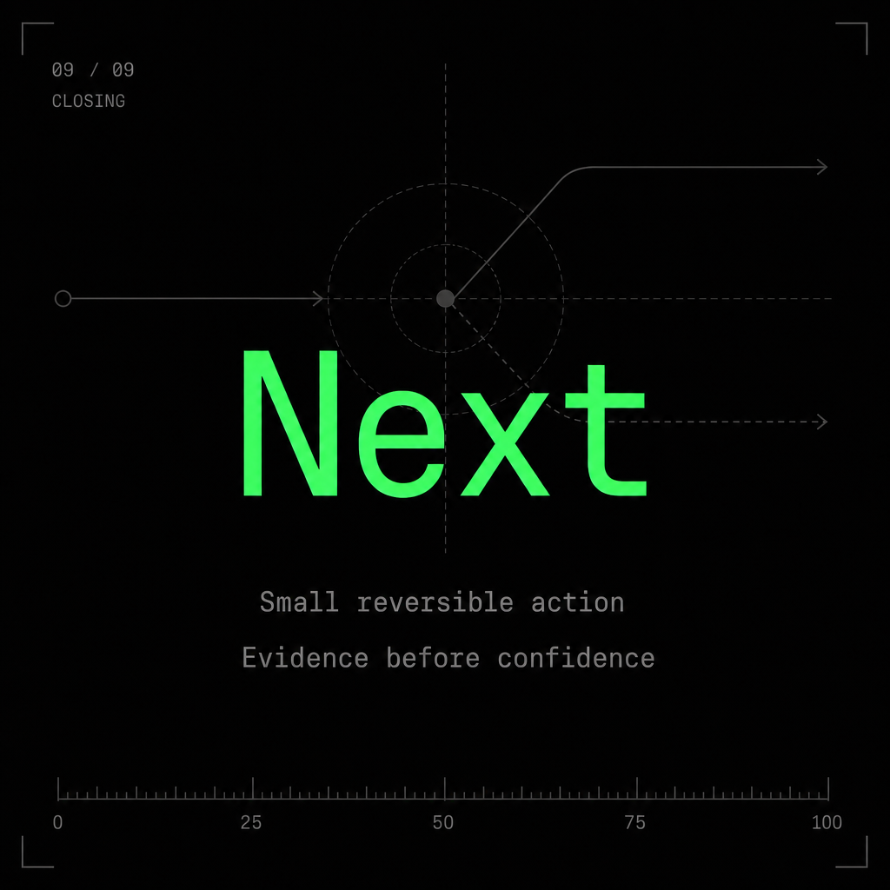

# Crucible

**A tiny Codex skill set for better decisions.**

Crucible turns vague thinking into a small, testable next move. It is not a debate simulator or a heavyweight agent framework. It is a compact decision hygiene loop: open the question, pressure-test the plan, audit the conclusion, then decide.

```text
open question
  -> crucible-panel
  -> crucible-grill-me / crucible-grill-you
  -> crucible-escalate
  -> crucible-decide
```

## Gallery

<table>
  <tr>
    <td align="center"><br><sub>Crucible</sub></td>
    <td align="center"><br><sub>Router</sub></td>
    <td align="center"><br><sub>Panel</sub></td>
  </tr>
  <tr>
    <td align="center"><br><sub>Grill Me</sub></td>
    <td align="center"><br><sub>Grill You</sub></td>
    <td align="center"><br><sub>Escalate</sub></td>
  </tr>
  <tr>
    <td align="center"><br><sub>Decide</sub></td>
    <td align="center"><br><sub>Install</sub></td>
    <td align="center"><br><sub>Next</sub></td>
  </tr>
</table>

## Skills

| Skill | Use When | Output |
|---|---|---|
| `crucible` | You want the agent to choose the smallest useful next move. | Routes to one Crucible skill. |
| `crucible-panel` | The question is still open and needs multiple views. | Real conflict + smallest next test. |
| `crucible-grill-me` | You want to be questioned interactively about a plan. | Shared understanding + open decisions. |
| `crucible-grill-you` | A plan exists and you want no back-and-forth. | Stronger plan + verification step. |
| `crucible-escalate` | The conclusion is high-stakes or may be biased. | Adversarial audit + revised conclusion. |
| `crucible-decide` | Discussion should stop and action should start. | Decision or missing evidence. |

## Architecture

Crucible is a set of small operators, not one large workflow.

```text
crucible
  routes only

crucible-panel
  opens uncertainty

crucible-grill-me
crucible-grill-you
  stress-test a plan

crucible-escalate
  attacks the final conclusion

crucible-decide
  closes the loop
```

Each skill is a plain directory with one `SKILL.md`. There are no scripts, services, or runtime dependencies.

## Install

From this repository:

```bash
cd /public/home/jxtang/project/cs/skills-lib/Crucible
mkdir -p "${CODEX_HOME:-$HOME/.codex}/skills"

for skill in crucible crucible-panel crucible-grill-me crucible-grill-you crucible-escalate crucible-decide; do
  cp -R "$skill" "${CODEX_HOME:-$HOME/.codex}/skills/"
done
```

For local development, symlink instead of copying:

```bash
cd /public/home/jxtang/project/cs/skills-lib/Crucible
mkdir -p "${CODEX_HOME:-$HOME/.codex}/skills"

for skill in crucible crucible-panel crucible-grill-me crucible-grill-you crucible-escalate crucible-decide; do
  ln -sfn "$PWD/$skill" "${CODEX_HOME:-$HOME/.codex}/skills/$skill"
done
```

## Use

Start with the router when you are unsure:

```text
Use crucible on this decision.
```

Call a specific operator when the need is clear:

```text
Use crucible-panel to explore this research direction.
Use crucible-grill-you to stress-test this implementation plan.
Use crucible-escalate before we trust this conclusion.
Use crucible-decide and give me the smallest next action.
```

## Design Rules

- Prefer the smallest useful next move.
- Do not turn every decision into a long workflow.
- Label simulated perspectives as simulated.
- Isolate audits when possible.
- Decide when more discussion will not improve the action.
